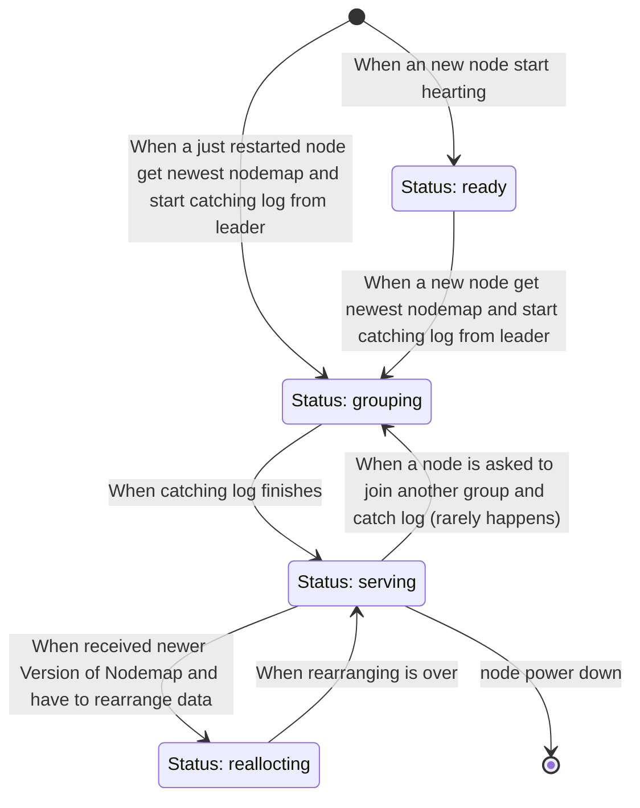

# Monitor
Monitor is the brain of Index Layer.
It monitors Storage Layer status and performs recovery. e.g.
- Monitor Storage Nodes cluster scales up/down
- Monitor health of Storage Nodes
- Provide Storage Nodes' information to other layers
- Detect and recover data corruptions (Hard disk sometimes corrupts files)
- Detect and recover Node Failures

## Endpoints
- `/heartbeat` StorageNode request this Endpoint to update status and report health.
e.g. (example contains comments which are not supported by JSON. Please delete these comments when trying)
```json5
{
  "Status": "ready", // ready, reallocating, grouping, serving
  "NodeId": "1",
  "Role": "Leader",
  "Addr": "127.0.0.1:12345",
  "Group": "0",
  "NodemapVersion": 1, // The newest received nodemap version
}
```
```json5
//response:
{
  "NodemapVersion": 2, // Tell StorageNode the newest Nodemap version
}
```
- `/nodemap?NodeId=` Get nodemap. e.g.
```json5
//response:
{
  "Nodemap": {
    "0": {
      "Range": ["0","7FFFFFFFFFFFF..."],
      "NodeAddrs": ["127.0.0.1:12345"]
    },
    "1": {
      "Range": ["8FFFFFFFFFF...","FFFFFFFFFFFF.."],
      "NodeAddrs": ["127.0.0.1:12346"]
    }, //Could have more...
  }
}
```


Everytime nodemap updating, there is only 1 grouping update or only 1 reallocating update.

grouping algorithm:
1. tell the nodes the newest nodemap
2. nodes findout the group it should be in.
3. If new nodes are grouping, they find the first node in group nodes list and elect it the first term leader.
4. When a node catch up with their new leader, Status -> ready.

Everytime reallocating, there are only two neighbour segment involved. One shrinking and one growing.
The segment shrinking is the source segment, the segment growing is the destination segment
Reallocating algorithm:
1. Source segment and destination segment have both received newest nodemap.
2. Source segment routes file writes intersecting area to shrinking segment, destination segment will log it.
3. Destination segment get all files from source segment.
4. Destination segment replay file writes.
5. Reallocating is over.
