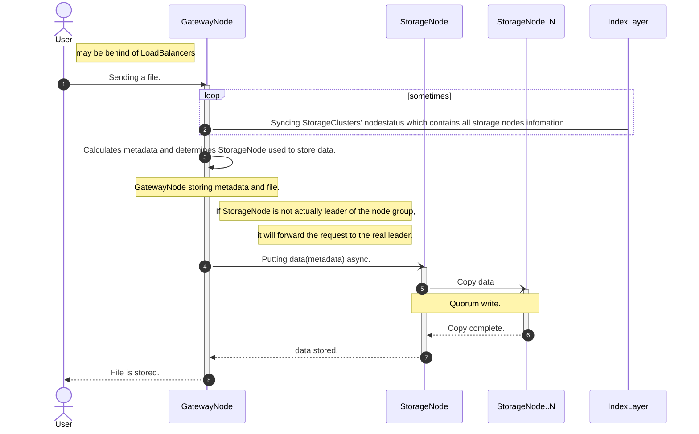
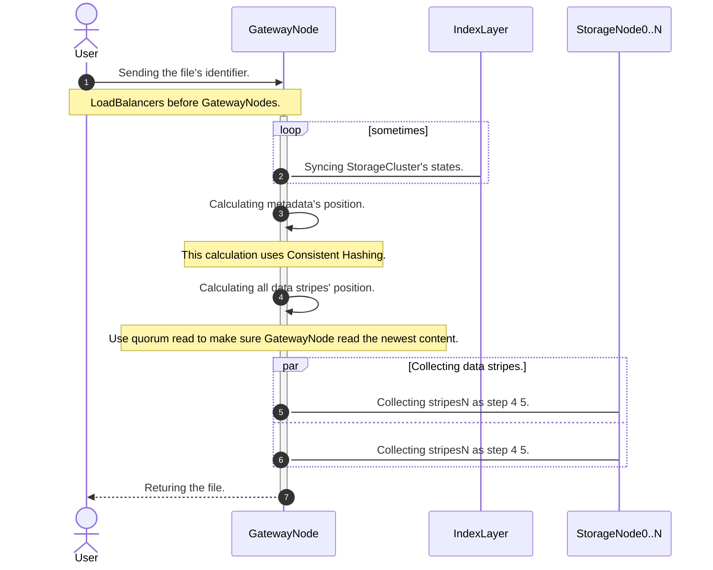
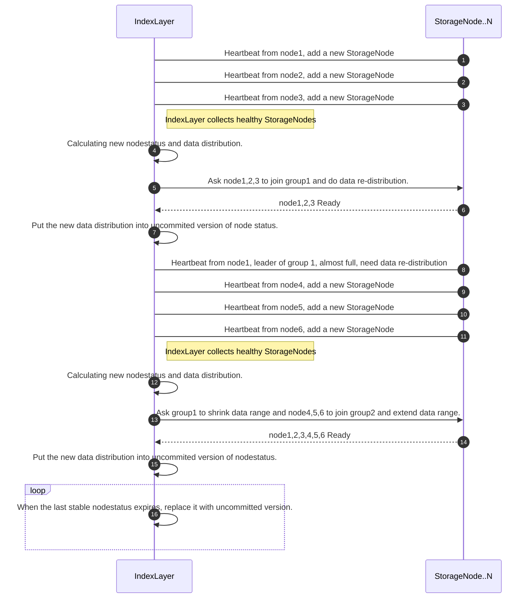

# HADSS
HADSS is short for High Availability Distributed Storage System.

HADSS can be used as backend of a Object Storage Service.

## Design Philosophy
High Availability in HADSS stands for:
1. No Single Point Failure.
2. Responsive even when clusters scale up/down.

HADSS can answer basic requests even when the entire Index Layer is down.

## Architecture
HADSS consists of 3 layers:
- Gateway Layer
- Index Layer
- Storage Layer

Each Layer contain nodes in different regions, data centers or racks.

### Gateway Layer
Gateway Layer faces users' requests.

Gateway Layer warps different kinds of storage services into RPCs to the Storage Layer and Index Layer.
e.g. The business logic for an Object Storage Service is usually on Gateway Layer.

The best practice in production is to place **Load Balancers** before Gateway Nodes.

### Index Layer
Index Layer monitors Storage Layer status and performs recovery. e.g.
- Monitor Storage Nodes cluster scales up/down
- Monitor health of Storage Nodes
- Provide Storage Nodes' information to other layers
- Detect and recover data corruptions (Hard disk sometimes corrupts files)
- Detect and recover Node Failures

### Storage Layer
Storage Layer stores. It receives (Handler, ConsistencyPolicy, NodeStatusVersion(to be implemented)]) to store a file.
It can auto-balancing the storage usage between storage nodes by NodeStatus.

## How it works
The System's sequence diagram when storing a file by Object Storage Gateway.

The System's sequence diagram when fetching a file by Object Storage Gateway.

The System's sequence diagram when clusters scale up/down.

Storage Node Clusters scale up or down don't matter.
Storage Nodes' data re-balancing matters.

Why: if adding nodes or losing nodes won't change data distribution, then it doesn't matter.
Only data re-balancing matters, because it will change data distribution.

## Testing
### E2E test
Execute `run.sh` to testrun the whole system.

### Integration test
StorageConnector has Integration tests in `connector_test.go` to verify the interface inplementation correctness.

### Unit test
StorageConnector has unit tests in `connector_test.go` to verify the right behaviour.
