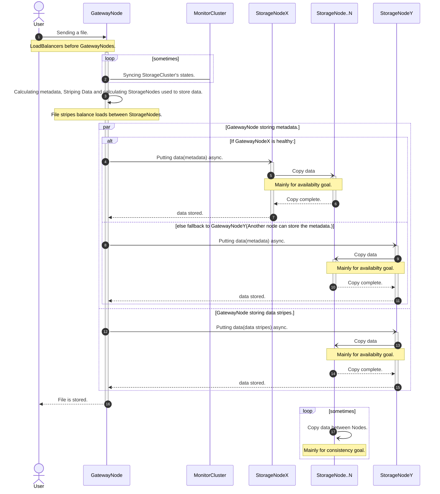
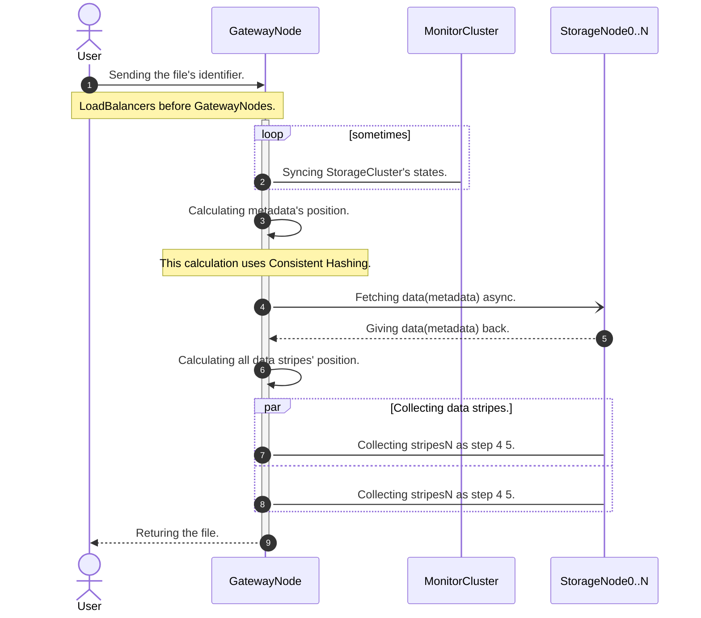

# HADSS
HADSS is short for High Availability Distributed Storage System.

HADSS can be used as backend of a Object Storage Service.

## Design Philosophy
High Availability in HADSS stands for:
1. No Single Point Failure.
2. Responsive even when clusters scale up/down.

HADSS can answer basic requests even when the entire Monitor Layer is down.

## Architecture
HADSS consists of 3 layers:
- Gateway Layer
- Monitor Layer
- Storage Layer

Each Layer contain nodes in different regions, data centers or racks.

### Gateway Layer
Gateway Layer faces users' requests.

Gateway Layer warps different kinds of storage services into RPCs to the Storage Layer and Monitor Layer.
e.g. The business logic for an Object Storage Service is usually on Gateway Layer.

The best practice in production is to place **Load Balancers** before Gateway Nodes.

### Monitor Layer
Monitor Layer monitors Storage Layer status and performs recovery. e.g.
- Monitor health of Storage Nodes
- Monitor Storage Nodes cluster scales up/down
- Detect and recover data corruptions (Hard disk sometimes corrupts files)
- Detect and recover Node Failures (Hard disk sometimes corrupts files)

### Storage Layer
Storage Layer stores. It receives (Handler, ConsistencyPolicy, NodeStatusVersion(to be implemented)]) to store a file.
It can auto-balancing the storage usage between storage nodes by NodeStatus.

## How it works
The System's sequence diagram when storing a file by Object Storage Gateway.

The System's sequence diagram when fetching a file by Object Storage Gateway.

Storage Node Clusters scale up or down don't matter.
Storage Nodes' data re-balancing matters.

Why: if adding nodes or losing nodes won't change data distribution, then it doesn't matter.
Only data re-balancing matters, because it will change data distribution.

## Testing
### Unit test
